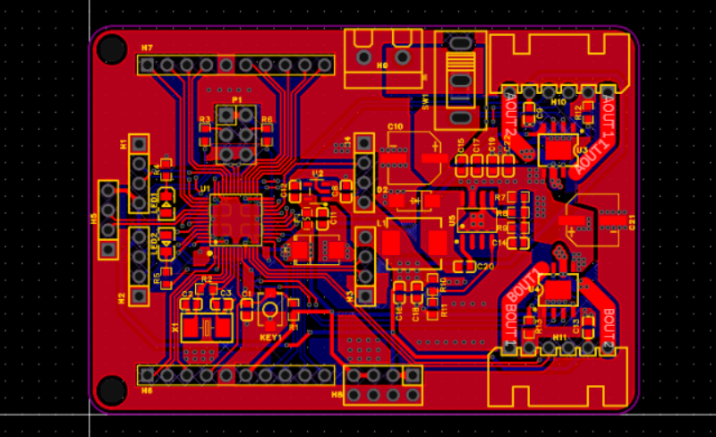

**English | [简体中文](README_cn.md)**
<div id="top"></div>

[![Contributors][contributors-shield]][contributors-url]
[![Forks][forks-shield]][forks-url]
[![Stargazers][stars-shield]][stars-url]
[![Issues][issues-shield]][issues-url]
[![License][license-shield]][license-url]


<!-- PROJECT LOGO -->
<br />
<div align="center">
    <a href="https://github.com/MoonGrt/PCB">
    
    </a>
<h3 align="center">PCB</h3>
    <p align="center">
    A repository dedicated to PCB design and development, supported by JLCPCB. Access resources and tools for electronic engineers, manufacturers, and enthusiasts.
    <br />
    <a href="https://github.com/MoonGrt/PCB"><strong>Explore the docs »</strong></a>
    <br />
    <a href="https://github.com/MoonGrt/PCB">View Demo</a>
    ·
    <a href="https://github.com/MoonGrt/PCB/issues">Report Bug</a>
    ·
    <a href="https://github.com/MoonGrt/PCB/issues">Request Feature</a>
    </p>
</div>


<!-- CONTENTS -->
<details open>
  <summary>Contents</summary>
  <ol>
    <li><a href="#file-tree">File Tree</a></li>
    <li>
      <a href="#about-the-project">About The Project</a>
      <ul>
      </ul>
    </li>
    <li><a href="#contributing">Contributing</a></li>
    <li><a href="#license">License</a></li>
    <li><a href="#contact">Contact</a></li>
    <li><a href="#acknowledgments">Acknowledgments</a></li>
  </ol>
</details>


<!-- FILE TREE -->
## File Tree

```
└─ Project
  ├─ LICENSE
  ├─ README.md
  ├─ /fly_ctrl/
  │ ├─ image
  │ └─ ProDoc_fly_ctrl2_4_2024-08-11.epro
  └─ /stm32_motordrive/
    ├─ stm32_motordrive.epro
    └─ /image/
      ├─ pcb_3d.png
      ├─ pcb_b.png
      ├─ pcb_t.png
      ├─ sch.png
      ├─ version1.png
      └─ version2.png

```


<!-- ABOUT THE PROJECT -->
## About The Project

<p style=" margin-top:0px; margin-bottom:0px; margin-left:0px; margin-right:0px; -qt-block-indent:0; text-indent:0px;">This repository includes several hardware design projects, primarily focused on integrated circuit design and embedded system development. The projects include a quadcopter controller (fly_ctrl) and an STM32 motor driver board (stm32_motordrive), among others. Each project contains PCB layouts, schematics, and corresponding design files, aimed at assisting developers in rapid prototyping and hardware implementation.</p>
<p style="-qt-paragraph-type:empty; margin-top:0px; margin-bottom:0px; margin-left:0px; margin-right:0px; -qt-block-indent:0; text-indent:0px;"><br /></p>
<p style=" margin-top:0px; margin-bottom:0px; margin-left:0px; margin-right:0px; -qt-block-indent:0; text-indent:0px;">This is a control board designed specifically for quadcopters, integrating various sensors and control algorithms to achieve stable flight control and flexible navigation capabilities. The project provides complete circuit design and layout, making it suitable for drone enthusiasts and developers.</p>
<p align="center" style=" margin-top:0px; margin-bottom:0px; margin-left:0px; margin-right:0px; -qt-block-indent:0; text-indent:0px;"></p>
<p style="-qt-paragraph-type:empty; margin-top:0px; margin-bottom:0px; margin-left:0px; margin-right:0px; -qt-block-indent:0; text-indent:0px;"><br /></p>
<p style=" margin-top:0px; margin-bottom:0px; margin-left:0px; margin-right:0px; -qt-block-indent:0; text-indent:0px;">This project features an STM32 microcontroller-based motor driver board, capable of driving various DC and stepper motors. The design includes motor driving circuitry and control interfaces, aimed at providing efficient motor control solutions for embedded applications.</p>
<p align="center" style=" margin-top:0px; margin-bottom:0px; margin-left:0px; margin-right:0px; -qt-block-indent:0; text-indent:0px;"></p>
<p style="-qt-paragraph-type:empty; margin-top:0px; margin-bottom:0px; margin-left:0px; margin-right:0px; -qt-block-indent:0; text-indent:0px;"><br /></p></body></html>
<p align="right">(<a href="#top">top</a>)</p>


<!-- CONTRIBUTING -->
## Contributing

Contributions are what make the open source community such an amazing place to learn, inspire, and create. Any contributions you make are **greatly appreciated**.
If you have a suggestion that would make this better, please fork the repo and create a pull request. You can also simply open an issue with the tag "enhancement".
Don't forget to give the project a star! Thanks again!
1. Fork the Project
2. Create your Feature Branch (`git checkout -b feature/AmazingFeature`)
3. Commit your Changes (`git commit -m 'Add some AmazingFeature'`)
4. Push to the Branch (`git push origin feature/AmazingFeature`)
5. Open a Pull Request
<p align="right">(<a href="#top">top</a>)</p>


<!-- LICENSE -->
## License

Distributed under the MIT License. See `LICENSE` for more information.
<p align="right">(<a href="#top">top</a>)</p>


<!-- CONTACT -->
## Contact

MoonGrt - 1561145394@qq.com
Project Link: [MoonGrt/](https://github.com/MoonGrt/)
<p align="right">(<a href="#top">top</a>)</p>


<!-- ACKNOWLEDGMENTS -->
## Acknowledgments

* [Choose an Open Source License](https://choosealicense.com)
* [GitHub Emoji Cheat Sheet](https://www.webpagefx.com/tools/emoji-cheat-sheet)
* [Malven's Flexbox Cheatsheet](https://flexbox.malven.co/)
* [Malven's Grid Cheatsheet](https://grid.malven.co/)
* [Img Shields](https://shields.io)
* [GitHub Pages](https://pages.github.com)
* [Font Awesome](https://fontawesome.com)
* [React Icons](https://react-icons.github.io/react-icons/search)
<p align="right">(<a href="#top">top</a>)</p>


<!-- MARKDOWN LINKS & IMAGES -->
<!-- https://www.markdownguide.org/basic-syntax/#reference-style-links -->
[contributors-shield]: https://img.shields.io/github/contributors/MoonGrt/PCB.svg?style=for-the-badge
[contributors-url]: https://github.com/MoonGrt/PCB/graphs/contributors
[forks-shield]: https://img.shields.io/github/forks/MoonGrt/PCB.svg?style=for-the-badge
[forks-url]: https://github.com/MoonGrt/PCB/network/members
[stars-shield]: https://img.shields.io/github/stars/MoonGrt/PCB.svg?style=for-the-badge
[stars-url]: https://github.com/MoonGrt/PCB/stargazers
[issues-shield]: https://img.shields.io/github/issues/MoonGrt/PCB.svg?style=for-the-badge
[issues-url]: https://github.com/MoonGrt/PCB/issues
[license-shield]: https://img.shields.io/github/license/MoonGrt/PCB.svg?style=for-the-badge
[license-url]: https://github.com/MoonGrt/PCB/blob/master/LICENSE

